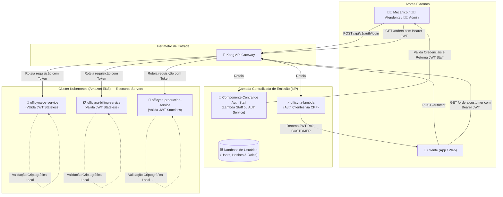
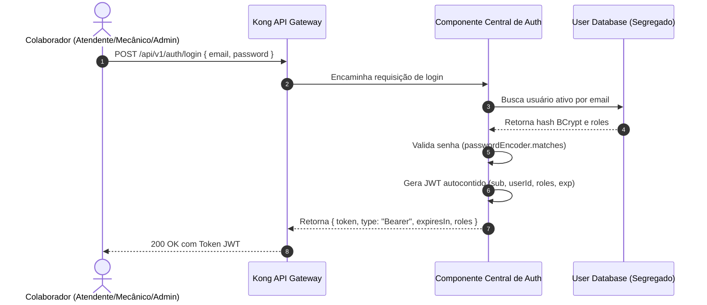
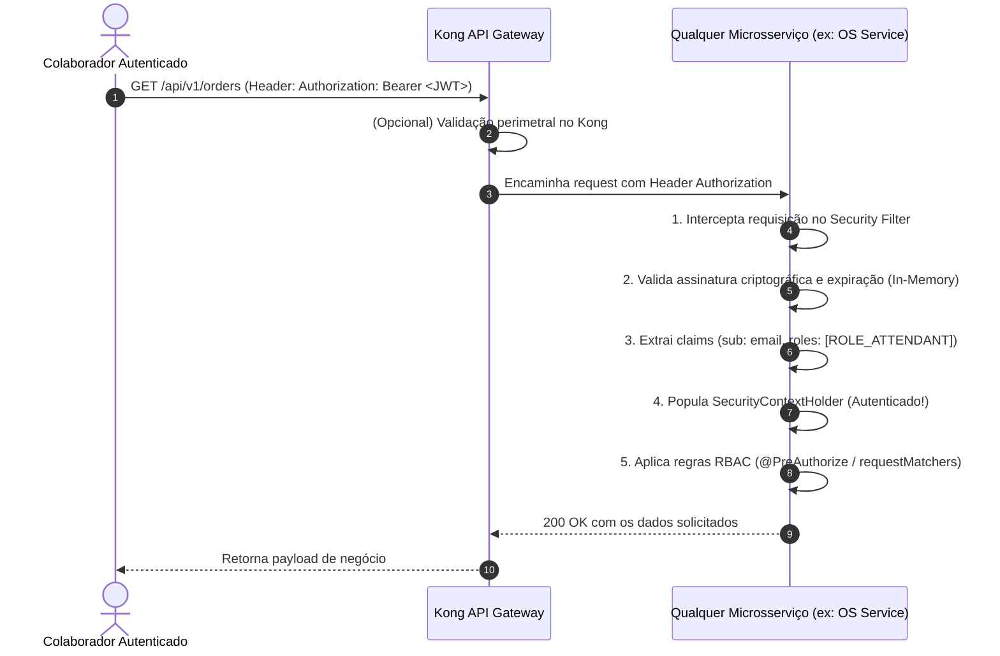

# 🔐 Arquitetura Centralizada de Autenticação e Autorização em Microsserviços

**Projeto:** Officyna — Tech Challenge Fase 4  
**Data:** Outubro de 2026  
**Status:** Proposto / Em Refinamento  
**Contexto:** Transição da arquitetura monolítica para microsserviços segregados

---

## 1. 📌 Contexto e Diagnóstico do Problema

### 1.1. O Cenário Anterior (Monólito `officyna-service`)
No monólito da Fase 3, a gestão de usuários e a segurança estavam acopladas no mesmo processo e no mesmo banco de dados (MongoDB):
- O módulo `administrative.user` continha entidades e repositórios para os colaboradores (`ADMIN`, `ATTENDANT`, `MECHANIC`, `MANAGER`).
- O endpoint `/api/auth/login` gerava um token JWT assinado simetricamente (`HS256`).
- O filtro `JwtAuthenticationFilter` executava, **a cada requisição HTTP recebida**, uma consulta direta ao banco de dados através de `userDetailsService.loadUserByUsername(email)`.

### 1.2. O Desafio na Migração para Microsserviços (Fase 4)
Conforme definido no [plano-fase4-tech-challenge.md](file:///c:/desnv/intelij-workspace/officyna/plano-fase4-tech-challenge.md), o sistema passa a ser composto por no mínimo 3 microsserviços independentes (`officyna-os-service`, `officyna-billing-service`, `officyna-production-service`), cada um com **banco de dados exclusivo (Database-per-Service)** e repositório Git isolado.

Ao extrair o primeiro microsserviço ([officyna-os-service](file:///c:/desnv/intelij-workspace/officyna/officyna-os-service)), surgiram os seguintes problemas:
1. **Quebra do Isolamento de Dados:** Se `os-service`, `billing-service` e `production-service` precisarem consultar a tabela de usuários, todos precisariam acessar o mesmo banco de dados — violando a regra mandatória de Database-per-Service.
2. **Latência e Acoplamento Temporal:** Fazer com que cada microsserviço chame um serviço de usuários via HTTP para cada requisição recebida geraria alto tráfego de rede, latência inaceitável e efeito cascata (se o serviço de usuários oscilar, todos os microsserviços caem).
3. **Paliativo Temporário no Código Atual:** No [officyna-os-service](file:///c:/desnv/intelij-workspace/officyna/officyna-os-service), o pacote de usuários foi removido, forçando a criação de um [UserDetailsServiceImpl](file:///c:/desnv/intelij-workspace/officyna/officyna-os-service/src/main/java/br/com/officyna/infrastructure/security/UserDetailsServiceImpl.java) mockado em memória com o comentário `// TODO: Substituir pela consulta ao serviço de usuarios`.
4. **Mistura de Conceitos de Domínio (DDD):** No planejamento inicial, sugeriu-se enviar `administrative.user` para o `officyna-production-service` por conter mecânicos. Porém, usuários do sistema também englobam **Administradores**, **Atendentes** e **Gerentes**, que operam ordens de serviço e faturamento. Gestão de Identidade (IAM) não pertence ao contexto de chão de oficina.

---

## 2. 🏛️ Arquitetura Proposta: Identity Provider Centralizado + Stateless Resource Servers

A solução arquitetural definitiva adota o padrão **Token-Based Stateless Authentication (OAuth2 Resource Server Pattern)**, distinguindo claramente as responsabilidades de **Emissão de Token (IdP)** da **Validação de Token (Resource Servers)**.



### 2.1. Princípios da Arquitetura
1. **Emissão Centralizada (IdP):** Apenas o componente de autenticação conhece senhas, regras de login e gera os tokens JWT.
2. **Consumo 100% Stateless nos Microsserviços:** Nenhum microsserviço de negócio possui `UserDetailsService`, tabela de usuários ou chama serviços externos para validar tokens.
3. **Tokens Autocontidos (Self-Contained):** O payload do JWT transporta os dados de identificação e autorização (`sub`, `userId`, `roles`, `name`).
4. **Validação Criptográfica Local:** O microsserviço valida apenas a assinatura e expiração do token em memória (tempo de execução sub-milissegundo).

---

## 3. 🔄 Diagramas de Sequência

### 3.1. Fluxo de Login do Usuário Interno (Emissão)


### 3.2. Fluxo de Consumo de Rota Protegida em Qualquer Microsserviço


---

## 4. 📄 Contrato de Dados do Token JWT

Para garantir compatibilidade entre o fluxo de clientes (já existente via [officyna-lambda](file:///c:/desnv/intelij-workspace/officyna/officyna-lambda)) e o novo fluxo de usuários internos, adota-se um contrato unificado de claims:

```json
{
  "sub": "atendente@officyna.com",
  "userId": "6724a1b8e4b0123456789abc",
  "name": "Maria Atendente",
  "roles": ["ROLE_ATTENDANT"],
  "userType": "STAFF",
  "iss": "officyna-auth",
  "iat": 1727960000,
  "exp": 1728046400
}
```

### Diferenciação de Perfis pelo Token:
- **Clientes (emitido pela `officyna-lambda`):**  
  `userType: "CUSTOMER"`, `roles: ["ROLE_CUSTOMER"]`, `sub: "<CPF ou Email>"`, `customerId: "<ID>"`
- **Colaboradores Internos (emitido pelo Auth Central):**  
  `userType: "STAFF"`, `roles: ["ROLE_ADMIN" | "ROLE_ATTENDANT" | "ROLE_MECHANIC" | "ROLE_MANAGER"]`, `sub: "<Email>"`, `userId: "<ID>"`

---

## 5. 💻 Padrões de Implementação nos Microsserviços

Existem duas formas equivalentes de implementar a validação stateless nos microsserviços. Cada microsserviço de negócio deve adotar uma delas:

### Abordagem A: Filtro Customizado Stateless (Evolução do Código Atual)
Mantém o `JwtService` e `JwtAuthenticationFilter`, eliminando toda dependência de `UserDetailsService`:

```java
@Component
@RequiredArgsConstructor
public class StatelessJwtAuthenticationFilter extends OncePerRequestFilter {

    private final JwtService jwtService;

    @Override
    protected void doFilterInternal(
            @NonNull HttpServletRequest request,
            @NonNull HttpServletResponse response,
            @NonNull FilterChain filterChain
    ) throws ServletException, IOException {

        String authHeader = request.getHeader("Authorization");
        if (authHeader == null || !authHeader.startsWith("Bearer ")) {
            filterChain.doFilter(request, response);
            return;
        }

        String token = authHeader.substring(7);
        try {
            if (jwtService.isTokenValid(token) && SecurityContextHolder.getContext().getAuthentication() == null) {
                Claims claims = jwtService.extractAllClaims(token);
                String username = claims.getSubject();
                
                // Extração direta das roles a partir das claims do JWT (sem consulta a banco!)
                List<SimpleGrantedAuthority> authorities = jwtService.extractAuthorities(claims);

                UsernamePasswordAuthenticationToken authentication =
                        new UsernamePasswordAuthenticationToken(username, null, authorities);
                authentication.setDetails(new WebAuthenticationDetailsSource().buildDetails(request));

                SecurityContextHolder.getContext().setAuthentication(authentication);
            }
        } catch (JwtException e) {
            logger.warn("Token JWT inválido: {}", e.getMessage());
        }

        filterChain.doFilter(request, response);
    }
}
```

### Abordagem B: Spring Security OAuth2 Resource Server (Padrão Nativo Spring Boot)
Adiciona a dependência no `pom.xml`:
```xml
<dependency>
    <groupId>org.springframework.boot</groupId>
    <artifactId>spring-boot-starter-oauth2-resource-server</artifactId>
</dependency>
```

Configuração declarativa no `SecurityConfig.java`:
```java
@Configuration
@EnableWebSecurity
@EnableMethodSecurity
public class SecurityConfig {

    @Bean
    public SecurityFilterChain filterChain(HttpSecurity http) throws Exception {
        return http
            .csrf(AbstractHttpConfigurer::disable)
            .sessionManagement(s -> s.sessionCreationPolicy(SessionCreationPolicy.STATELESS))
            .authorizeHttpRequests(auth -> auth
                .requestMatchers("/swagger-ui/**", "/api-docs/**", "/actuator/health").permitAll()
                // Regras RBAC específicas do microsserviço
                .requestMatchers(HttpMethod.POST, "/api/v1/orders/**").hasAnyRole("ATTENDANT", "ADMIN")
                .requestMatchers(HttpMethod.PATCH, "/api/v1/orders/**/status").hasAnyRole("MECHANIC", "ADMIN")
                .requestMatchers(HttpMethod.GET, "/api/v1/orders/customer/**").hasAnyRole("CUSTOMER", "ATTENDANT", "ADMIN")
                .anyRequest().authenticated()
            )
            .oauth2ResourceServer(oauth2 -> oauth2
                .jwt(jwt -> jwt.jwtAuthenticationConverter(jwtAuthenticationConverter()))
            )
            .build();
    }

    private Converter<Jwt, ? extends AbstractAuthenticationToken> jwtAuthenticationConverter() {
        JwtAuthenticationConverter converter = new JwtAuthenticationConverter();
        converter.setJwtGrantedAuthoritiesConverter(jwt -> {
            List<String> roles = jwt.getClaimAsStringList("roles");
            if (roles == null) return List.of();
            return roles.stream()
                    .map(role -> role.startsWith("ROLE_") ? role : "ROLE_" + role)
                    .map(SimpleGrantedAuthority::new)
                    .collect(Collectors.toList());
        });
        return converter;
    }
}
```

> **Resultado:** Com qualquer uma das abordagens acima, as classes [UserDetailsServiceImpl.java](file:///c:/desnv/intelij-workspace/officyna/officyna-os-service/src/main/java/br/com/officyna/infrastructure/security/UserDetailsServiceImpl.java) e o `UserDetailsService` são **definitivamente eliminados** dos 3 microsserviços de negócio.

---

## 6. 🎛️ Matriz de RBAC por Microsserviço

Cada microsserviço protege suas próprias rotas declarativamente:

| Microsserviço | Rota / Operação | Roles Permitidas |
| :--- | :--- | :--- |
| **`officyna-os-service`** | `POST /api/v1/orders` (Abertura de OS) | `ROLE_ATTENDANT`, `ROLE_ADMIN` |
| | `GET /api/v1/orders/{id}` (Consulta Geral) | `ROLE_ATTENDANT`, `ROLE_ADMIN`, `ROLE_MECHANIC` |
| | `GET /api/v1/customer-service-orders/**` | `ROLE_CUSTOMER`, `ROLE_ATTENDANT`, `ROLE_ADMIN` |
| | `PATCH /api/v1/orders/{id}/diagnosis` | `ROLE_MECHANIC`, `ROLE_ADMIN` |
| **`officyna-billing-service`** | `POST /api/v1/billing/calculate` (Orçamento) | `ROLE_ATTENDANT`, `ROLE_ADMIN` |
| | `POST /api/v1/billing/payments` (Faturamento) | `ROLE_ATTENDANT`, `ROLE_ADMIN` |
| | `POST /api/v1/webhooks/mercadopago` | `permitAll()` (Autenticado por Signature Header do MP) |
| **`officyna-production-service`** | `POST /api/v1/production/labor-time` (Apontamento) | `ROLE_MECHANIC`, `ROLE_ADMIN` |
| | `PATCH /api/v1/production/tasks/{id}/start` | `ROLE_MECHANIC`, `ROLE_ADMIN` |
| | `PATCH /api/v1/production/tasks/{id}/finish` | `ROLE_MECHANIC`, `ROLE_ADMIN` |
| | `GET /api/v1/monitoring/**` (Produtividade) | `ROLE_MANAGER`, `ROLE_ADMIN` |

---

## 7. ⚖️ Opções para Construção do Componente Central de Autenticação

| Opção | Arquitetura | Vantagens | Desvantagens |
| :--- | :--- | :--- | :--- |
| **1. Lambda Serverless para Staff (`officyna-auth-staff-lambda`)** | Serverless Node.js/TypeScript ou Java (idêntica à `officyna-lambda`). | - Coerência total com a arquitetura serverless já aprovada no TC Fase 3.<br>- Custos sob demanda e zero infraestrutura fixa.<br>- Independência do cluster EKS. | - Manutenção de repositório serverless adicional. |
| **2. Microsserviço Dedicado de Auth (`officyna-auth-service`)** | Spring Boot + MongoDB/PostgreSQL isolado para `users`. | - Reaproveita 100% das classes legadas de [UserService.java](file:///c:/desnv/intelij-workspace/officyna/officyna-service/src/main/java/br/com/officyna/administrative/user/domain/service/UserService.java).<br>- CRUD de usuários completo com auditoria. | - Mais um container para deploy no cluster Kubernetes. |
| **3. Provedor de Identidade Gerenciado (AWS Cognito / Keycloak)** | Serviço IAM gerenciado na nuvem. | - Padrão corporativo avançado.<br>- Políticas de senha, MFA e rotação automáticas. | - Maior complexidade para emular em ambiente local (`docker-compose`). |

---

## 8. 🎯 Resumo da Decisão Arquitetural
1. **Adotar o modelo Token-Based Stateless (Resource Server)** para todos os microsserviços da Fase 4.
2. **Eliminar `UserDetailsService`** e chamadas a banco de dados nas camadas de segurança de `officyna-os-service`, `officyna-billing-service` e `officyna-production-service`.
3. **Extrair a gestão de usuários e login para componente centralizado**, mantendo os microsserviços desacoplados e com seus próprios bancos de dados isolados.
