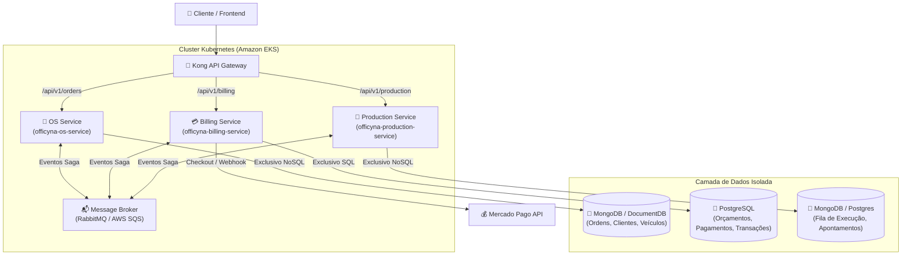
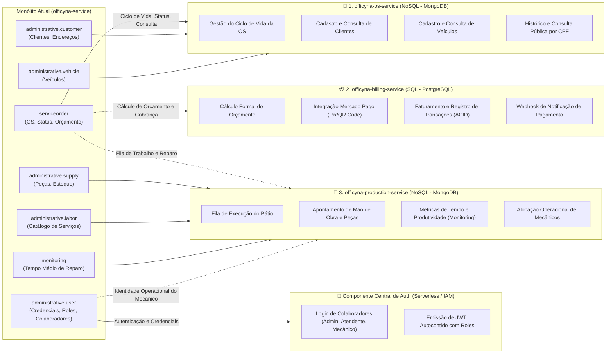
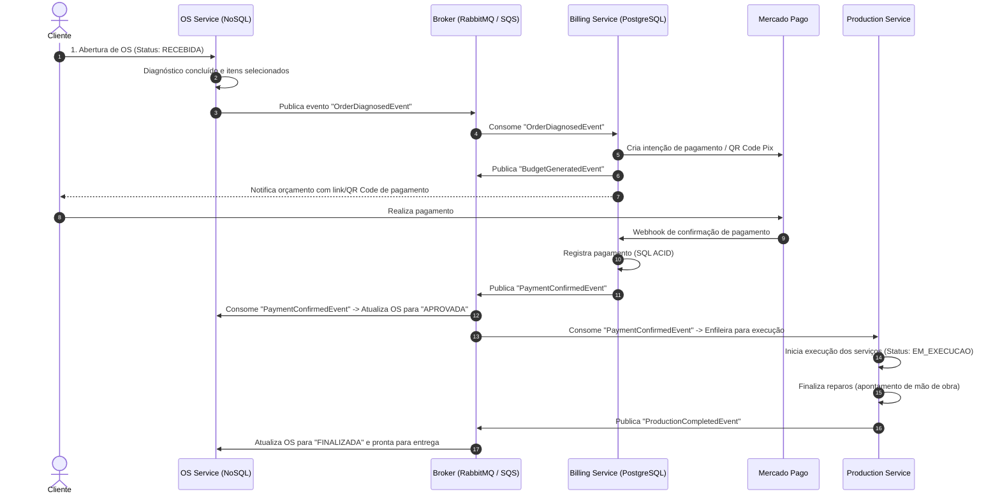
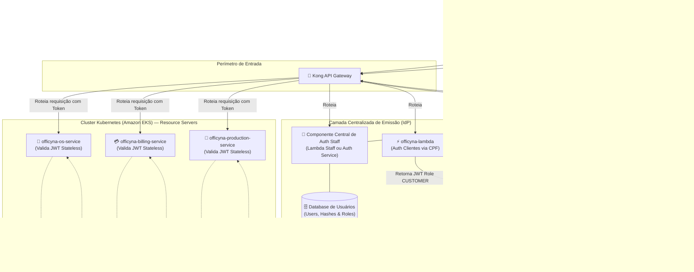
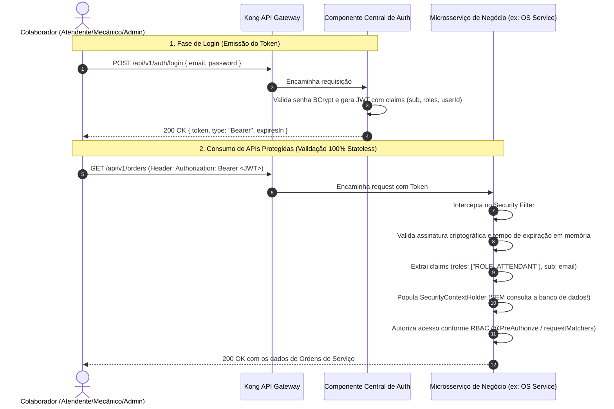
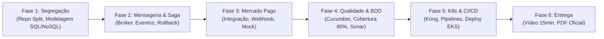

# 📋 Análise de Gaps e Plano de Trabalho — Tech Challenge Fase 4 (Officyna)

---

## 1. 🎯 Visão Geral e Contexto da Transição (Fase 3 ➔ Fase 4)

Na **Fase 3**, o ecossistema `Officyna` alcançou maturidade em nuvem (AWS) com a aplicação principal conteinerizada no **Amazon EKS**, banco de dados gerenciado **Amazon DocumentDB** (NoSQL), autenticação serverless com **AWS Lambda**, **Kong API Gateway** como roteador de perímetro e observabilidade integrada com **New Relic** e logs estruturados.

Para a **Fase 4**, a oficina atinge escala nacional e múltiplas filiais. Os novos objetivos centrais são:
1. **Desacoplamento do Monólito em Microsserviços**: Divisão em no mínimo **3 microsserviços independentes**, cada um com seu próprio repositório Git, infraestrutura, pipeline de CI/CD e banco de dados.
2. **Poliglotia de Persistência Obrigatória**: Obrigatoriedade de uso de pelo menos **um banco relacional (SQL)** e pelo menos **um banco não relacional (NoSQL)**, garantindo que nenhum serviço acesse a base de outro.
3. **Gestão Transacional Distribuída (Saga Pattern)**: Coordenação das transações de negócio (Abertura de OS ➔ Orçamento ➔ Aprovação/Pagamento ➔ Execução) com capacidade de compensação/rollback em caso de falha.
4. **Integração com Mercado Pago**: Criação de orçamentos e processamento de pagamentos reais/simulados via API do Mercado Pago.
5. **Qualidade Rigorosa e BDD**: Cobertura unitária mínima de **80%**, validação contínua no **SonarQube** e pelo menos um fluxo de negócio completo coberto por **BDD (Cucumber)**.
6. **Deploy Contínuo e Entregáveis**: Pipelines de CI/CD completas para cada serviço, vídeo demonstrativo (até 15 min) e documentação formal em PDF para entrega no portal acadêmico.

---

## 2. 🔍 Matriz de Análise de Gaps (Estado Atual vs Requisitos Fase 4)

| Requisito do Edital (Fase 4) | Estado Atual no Projeto | Gap Identificado | Severidade |
| :--- | :--- | :--- | :---: |
| **Divisão em ≥ 3 Microsserviços** | Monólito `officyna-service` contém OS, Clientes, Veículos, Mão de Obra, Peças e Monitoramento juntas. | Não há divisão em microsserviços independentes com repositórios separados. | 🔴 **Crítico** |
| **Repositórios Independentes** | Apenas `officyna-service`, `officyna-lambda`, `officyna-infra-db`, `officyna-infra-k8s` e `doc`. | Faltam os repositórios dos novos serviços (`officyna-billing-service`, `officyna-production-service`). | 🔴 **Crítico** |
| **Banco de Dados Relacional (SQL) e NoSQL** | Apenas `officyna-infra-db` com Amazon DocumentDB (NoSQL). | Falta um banco **SQL (ex: PostgreSQL)** provisionado e utilizado em pelo menos um serviço. | 🔴 **Crítico** |
| **Isolamento de Bancos (Database-per-Service)** | O DocumentDB é compartilhado pelo monólito e pela Lambda. | Necessidade de segregar esquemas/bancos para garantir que nenhum microsserviço acesse o banco de outro. | 🔴 **Crítico** |
| **Implementação de Saga Pattern** | Operações síncronas in-memory no monólito; sem compensação ou rollback distribuído. | Não há padrão Saga (Coreografado ou Orquestrado) implementado com transações compensatórias. | 🔴 **Crítico** |
| **Mensageria Assíncrona** | Nenhuma fila ou broker provisionado. Comunicação era estritamente HTTP local. | Ausência de broker de eventos (RabbitMQ / AWS SQS / Kafka) para eventos do Saga. | 🔴 **Crítico** |
| **Integração com Mercado Pago** | Inexistente. Apenas cálculo estático de orçamento no domínio. | Falta integração completa com Mercado Pago (geração de QR Code / Pix e webhook de confirmação). | 🔴 **Crítico** |
| **Testes com BDD** | Testes unitários com JUnit 5 e Mockito. Zero arquivos `.feature` ou Cucumber. | Ausência total de testes de comportamento (BDD) cobrindo o fluxo de ponta a ponta. | 🟡 **Alto** |
| **Cobertura de Código ≥ 80%** | `officyna-service` configurado com JaCoCo (80%). Lambda possui Jest. | Cada novo microsserviço precisa atingir e garantir ≥ 80% de cobertura individual. | 🟡 **Alto** |
| **SonarQube nos Pipelines** | Configurado no pipeline do `officyna-service` via SonarCloud. | Necessário replicar e configurar o Quality Gate do SonarQube nos novos repositórios. | 🟡 **Alto** |
| **Roteamento Kong API Gateway** | Kong configurado para apontar para o monólito único (`url: http://officyna-service:80`). | Kong precisa ser reconfigurado com rotas distribuídas para os 3 microsserviços. | 🟡 **Alto** |
| **Autenticação e IAM em Microsserviços** | Monólito centralizava autenticação com consulta a banco em cada request; segregação gerou stubs em memória (`UserDetailsServiceImpl`). | Ausência de componente central de emissão de tokens para colaboradores e falta de validação stateless (Resource Server) nos microsserviços. | 🔴 **Crítico** |
| **Vídeo de Demonstração e PDF de Entrega** | Apenas documentação da Fase 3 existente em `doc/`. | Falta gravar o vídeo de até 15 min e consolidar o PDF final com arquitetura e justificativas. | 🟡 **Alto** |

---

## 3. 🏛️ Arquitetura Alvo Proposta

### 3.1. Divisão dos Microsserviços e Persistência



### 3.2. Justificativa das Tecnologias de Banco de Dados

1. **OS Service (NoSQL - MongoDB / DocumentDB)**:
   - *Motivo*: Ordens de Serviço possuem estrutura dinâmica e rica, agrupando dados cadastrais, snapshot de veículo e cliente, múltiplos itens e histórico de alterações em um único documento JSON hierárquico com baixa latência de leitura.
2. **Billing Service (SQL - PostgreSQL)**:
   - *Motivo*: Operações financeiras, orçamentos, faturas e registros de pagamento exigem garantias **ACID estritas**, integridade referencial física e rastreabilidade contábil à prova de inconsistências. Atende diretamente à exigência da banca de utilizar banco relacional SQL.
3. **Production Service (NoSQL / SQL)**:
   - *Motivo*: Fila de tarefas de oficina mecânica com alta concorrência de leitura e escrita e métricas temporais de produtividade.

### 3.3. Mapeamento "De ➔ Para" dos Módulos (Monólito ➔ Microsserviços)



#### Tabela Detalhada "De ➔ Para"

| Pacote / Módulo Atual (`officyna-service`) | O que contém hoje (Classes Principais) | Para onde vai na Fase 4 | Banco de Dados | Justificativa Arquitetural (DDD / Edital) |
| :--- | :--- | :--- | :--- | :--- |
| **`serviceorder`** *(Abertura, Status e Ciclo)* | `ServiceOrder`, `ServiceOrderStatus`, `ServiceOrderController`, `CustomerServiceOrderController` | **`officyna-os-service`** | **NoSQL** *(MongoDB)* | Núcleo do atendimento. Centraliza a criação da OS e o agregado raiz com histórico de estados. |
| **`administrative.customer`** | `Customer`, `Address`, `CustomerType`, `DocumentValidator` | **`officyna-os-service`** | **NoSQL** *(MongoDB)* | Cadastro de clientes e validação de CPF/CNPJ pertencem ao contexto de entrada/balcão. |
| **`administrative.vehicle`** | `Vehicle`, `VehicleController`, `VehicleRepository` | **`officyna-os-service`** | **NoSQL** *(MongoDB)* | O veículo é o ativo central identificado na recepção da oficina. |
| **`serviceorder`** *(Cálculo de Orçamento e Total)* | Regras de `totalBudgetAmount`, `LaborSituation` (Aprovação de valores) | **`officyna-billing-service`** *(Novo)* | **SQL** *(PostgreSQL)* | **Exigência de banco relacional SQL**: Orçamentos, itens cobrados, faturas e conciliação financeira exigem garantias **ACID estritas**. |
| *(Inexistente hoje)* | *(Novo módulo)* | **`officyna-billing-service`** *(Mercado Pago)* | **SQL** *(PostgreSQL)* | **Exigência do Edital**: Comunicação com a API do Mercado Pago para gerar QR Code Pix e receber Webhooks IPN. |
| **`administrative.labor`** | `Labor`, `LaborController`, `LaborService` | **`officyna-production-service`** *(Novo)* | **NoSQL** *(MongoDB)* | Mão de obra operacional e estimativa de horas são consumidas diretamente pelos mecânicos no reparo. |
| **`administrative.supply`** | `Supply`, `SupplyType`, `StockService` | **`officyna-production-service`** *(Novo)* | **NoSQL** *(MongoDB)* | Insumos e peças aplicadas durante a execução física dos reparos no pátio. |
| **`administrative.user`** *(IAM / Colaboradores)* | `User`, `UserRole` (Admin, Atendente, Gerente, Mecânico), `AuthService` | **Componente Central de Auth** *(Lambda Staff / Auth Service)* | **NoSQL** *(MongoDB Exclusivo)* | Centralização da emissão de credenciais e tokens JWT com roles. Desacopla autenticação dos microsserviços de negócio. |
| **`administrative.user`** *(Operacional do Pátio)* | Mecânico alocado na execução de tarefas | **`officyna-production-service`** | **NoSQL** *(MongoDB)* | Alocação de mecânicos a tarefas da fila de produção (referenciados pelo `userId` das claims do JWT, sem gerenciar credenciais). |
| **`monitoring`** | `LaborMonitoring`, `LaborMonitoringService` | **`officyna-production-service`** *(Novo)* | **NoSQL** *(MongoDB)* | Métrica operacional direta: cálculo de tempo médio real gasto por serviço e eficiência da equipe. |

### 3.4. Papel e Responsabilidades do Production Service (Execução e Produção)

Conforme os requisitos da Fase 4, o **Production Service** atua como o sistema de **chão de oficina**, responsável por:
1. **Gerenciamento da Fila de Execução**: Recepção de ordens de serviço liberadas após confirmação de pagamento, organizando a esteira por prioridade e filial.
2. **Ciclo Operacional de Reparo**: Apontamento em tempo real do início dos trabalhos (`EM_EXECUCAO`), alocação de mecânicos e registro de tempo técnico gasto.
3. **Comunicação de Conclusão**: Disparo do evento `ProductionCompletedEvent` para que o `OS Service` transicione o status para `FINALIZADA` (veículo pronto para retirada).
4. **Métricas de Produtividade**: Absorção e evolução do submódulo `monitoring` para medição contínua de tempos médios de execução e eficiência operacional dos boxes.
5. **Participação no Rollback do Saga**: Em caso de impedimento técnico crítico ou falta definitiva de insumos no pátio, publicação de evento de cancelamento que aciona o estorno automático de pagamento no `Billing Service`.


---

## 4. 🔄 Estratégia do Saga Pattern (Coreografia vs Orquestração)

Para este projeto, propõe-se a abordagem **Saga Coreografada** (ou **Orquestrada pelo OS Service**, atuando como Coordenador do Ciclo de Vida da OS):

### 4.1. Fluxo Transacional (Caminho Feliz)



### 4.2. Matriz de Compensação e Rollback (Tratamento de Falhas)

| Ponto de Falha | Gatilho de Compensação | Ações de Rollback Executadas | Status Final da OS |
| :--- | :--- | :--- | :--- |
| **Cliente Rejeita Orçamento** | Cliente clica em recusar ou expira prazo. | `Billing Service` publica `BudgetRejectedEvent`. `OS Service` transiciona status; estoque/peças reservadas são liberadas. | `RECUSADA` |
| **Pagamento Recusado / Expirado** | Webhook do Mercado Pago com falha/expiração. | `Billing Service` publica `PaymentFailedEvent`. `OS Service` desmarca aprovação e notifica cliente. | `AGUARDANDO_APROVACAO` ou `RECUSADA` |
| **Falta de Peça / Bloqueio na Produção** | Produção detecta indisponibilidade crítica. | `Prod Service` publica `ProductionAbortedEvent`. `Billing Service` estorna o valor no Mercado Pago. `OS Service` registra o motivo da paralisação. | `CANCELADA_COM_ESTORNO` |

---

## 5. 🔐 Arquitetura Centralizada de Autenticação e RBAC (Usuários Internos & Clientes)

### 5.1. Contexto e Problema de Segurança na Segregação
Na arquitetura monolítica (`officyna-service`), a autenticação consultava o banco de dados via `UserDetailsService` a cada requisição HTTP recebida. Ao iniciar a extração para microsserviços:
- No `officyna-os-service`, a remoção da entidade `User` gerou um stub em memória (`UserDetailsServiceImpl`) com o comentário `// TODO: Substituir pela consulta ao serviço de usuarios`.
- Manter chamadas diretas a banco de dados ou chamadas HTTP síncronas para autenticar cada request nos microsserviços viola a diretriz de **Database-per-Service**, introduz alta latência e gera ponto único de falha.
- Enquanto os clientes já são autenticados de forma serverless pela [officyna-lambda](file:///c:/desnv/intelij-workspace/officyna/officyna-lambda) (via CPF), os **usuários internos do sistema** (Mecânicos, Atendentes, Gerentes e Administradores) necessitam de uma arquitetura centralizada, resiliente e desacoplada.

### 5.2. Arquitetura Alvo: IdP Centralizado + Stateless Resource Servers
A solução estabelece a separação estrita entre o **Emissor de Tokens (Identity Provider)** e os **Consumidores (Resource Servers)**:



### 5.3. Fluxo de Autenticação e Consumo de Rotas Protegidas



### 5.4. Contrato de Claims do Token JWT (Padronizado)
Para garantir compatibilidade transversal, o payload dos tokens contém:
```json
{
  "sub": "atendente@officyna.com",
  "userId": "6724a1b8e4b0123456789abc",
  "name": "Maria Atendente",
  "roles": ["ROLE_ATTENDANT"],
  "userType": "STAFF",
  "iss": "officyna-auth",
  "exp": 1728046400
}
```

### 5.5. Diretrizes de Implementação nos Microsserviços
1. **Eliminação do `UserDetailsServiceImpl`:** As classes `UserDetailsServiceImpl` e qualquer dependência de `UserDetailsService` devem ser **definitivamente deletadas** de `officyna-os-service`, `officyna-billing-service` e `officyna-production-service`.
2. **Resource Server Stateless:** Cada microsserviço adota validação in-memory:
   - **Opção Recomendada (Spring Boot Nativo):** `spring-boot-starter-oauth2-resource-server` com conversão de claims `roles` para `GrantedAuthority`.
   - **Opção Alternativa (Filtro Customizado):** `StatelessJwtAuthenticationFilter` que popula o `SecurityContextHolder` diretamente a partir de `jwtService.extractAllClaims(token)`.
3. **Documento Técnico de Referência:** A documentação completa com exemplos detalhados de código, matriz de RBAC e configuração do Kong está disponível em [doc/arquitetura-autenticacao-microsservicos.md](file:///c:/desnv/intelij-workspace/officyna/doc/arquitetura-autenticacao-microsservicos.md).

---

## 6. 📝 Detalhamento de Tarefas por Épicos (Backlog da Fase 4)

### ÉPICO 1: Arquitetura e Segregação dos Microsserviços
- [ ] **TASK-01**: Criar repositório `officyna-os-service` a partir do núcleo de OS do `officyna-service`, isolando entidades de Clientes, Veículos e Ordens de Serviço.
- [ ] **TASK-02**: Criar repositório `officyna-billing-service` (Spring Boot + PostgreSQL) responsável por cálculo de orçamentos, faturamento e pagamentos.
- [ ] **TASK-03**: Criar repositório `officyna-production-service` responsável pela esteira de oficina, filas de mecânicos e cronometragem de mão de obra.
- [ ] **TASK-04**: Limpar e remover dependências cruzadas em memória, garantindo isolamento total de código e ausência de chamadas diretas a banco de outros serviços.
- [ ] **TASK-04A**: Refatorar a camada de segurança do `officyna-os-service` para o padrão Stateless Resource Server, eliminando o `UserDetailsServiceImpl` em memória e ajustando os testes unitários.
- [ ] **TASK-04B**: Implementar/provisionar o Componente Central de Autenticação para colaboradores internos (Lambda Staff ou Auth Service dedicado), desacoplado dos microsserviços de negócio.

### ÉPICO 2: Persistência Poliglota e Infraestrutura de Dados
- [ ] **TASK-05**: Atualizar o repositório `officyna-infra-db` (Terraform) para provisionar uma instância de banco relacional (AWS RDS PostgreSQL) na mesma VPC.
- [ ] **TASK-06**: Configurar Spring Data JPA e Flyway/Liquibase no `officyna-billing-service` com modelagem relacional de orçamentos e pagamentos.
- [ ] **TASK-07**: Manter e adaptar o Spring Data MongoDB no `officyna-os-service` e `officyna-production-service` com credenciais e bancos isolados.
- [ ] **TASK-08**: Validar regra: nenhum serviço possui string de conexão ou acesso ao banco de dados dos outros serviços.

### ÉPICO 3: Mensageria e Implementação do Saga Pattern
- [ ] **TASK-09**: Provisionar o Message Broker (RabbitMQ em container no EKS via Helm/manifestos K8s, ou AWS SQS via Terraform).
- [ ] **TASK-10**: Desenhar e implementar o schema de eventos do Saga (`OrderCreatedEvent`, `BudgetCreatedEvent`, `PaymentConfirmedEvent`, `ProductionCompletedEvent` e eventos de compensação).
- [ ] **TASK-11**: Implementar produtores e consumidores de eventos nos três microsserviços com resiliência, retry e dead-letter queues (DLQ).
- [ ] **TASK-12**: Implementar lógica de compensação e rollback em caso de falha de pagamento ou interrupção de produção.
- [ ] **TASK-13**: Documentar a estratégia de Saga adotada (com diagramas e justificativas técnicas) no `README.md` dos repositórios.

### ÉPICO 4: Integração com Gateway de Pagamento (Mercado Pago)
- [ ] **TASK-14**: Criar conta de testes no Mercado Pago Developers e gerar credenciais de sandbox (Access Token / Public Key).
- [ ] **TASK-15**: Implementar cliente HTTP no `officyna-billing-service` para criação de ordens de pagamento (Pix / QR Code dinâmico).
- [ ] **TASK-16**: Criar endpoint de Webhook no `officyna-billing-service` para receber notificações IPN de pagamento aprovado/rejeitado do Mercado Pago.
- [ ] **TASK-17**: Criar mock de testes e endpoints simuladores para testes automatizados e demonstração sem depender de saldo real.

### ÉPICO 5: Qualidade de Software, BDD e Testes
- [ ] **TASK-18**: Configurar Cucumber BDD no `officyna-os-service` com cenários `.feature` em português ou inglês cobrindo o fluxo completo da OS.
- [ ] **TASK-19**: Escrever step definitions do Cucumber executando o ciclo de abertura, diagnóstico, aprovação e conclusão da OS.
- [ ] **TASK-20**: Garantir cobertura unitária com JUnit 5 / Mockito ≥ 80% em cada um dos 3 microsserviços (verificada via JaCoCo).
- [ ] **TASK-21**: Configurar análise estática com SonarQube / SonarCloud no pipeline de cada microsserviço garantindo aprovação do Quality Gate.

### ÉPICO 6: CI/CD, Orquestração e Observabilidade
- [ ] **TASK-22**: Criar pipelines independentes no GitHub Actions (`.github/workflows/cicd.yml`) para cada microsserviço (Build ➔ Testes ➔ SonarQube ➔ Docker Build/Push ➔ Deploy EKS).
- [ ] **TASK-23**: Criar Dockerfile otimizado (multi-stage build) e manifestos Kubernetes (`deployment.yaml`, `service.yaml`, `hpa.yaml`, `configmap.yaml`, `secret.yaml`) para cada serviço.
- [ ] **TASK-24**: Atualizar a configuração declarativa do **Kong API Gateway** (`kong.yml`) para rotear o tráfego externo para os 3 microsserviços.
- [ ] **TASK-25**: Configurar rastreamento distribuído (Correlation ID / OpenTelemetry / New Relic) propagando IDs de correlação através dos eventos de mensageria e chamadas HTTP.
- [ ] **TASK-26**: Configurar proteção de branch na `main` dos novos repositórios com Pull Request obrigatório e checks automáticos.

### ÉPICO 7: Entregáveis e Documentação da Fase 4
- [ ] **TASK-27**: Atualizar documentação de Swagger/OpenAPI e gerar Postman Collection completa com todos os endpoints dos 3 microsserviços.
- [ ] **TASK-28**: Elaborar documento PDF oficial da entrega contendo:
  - Identificação dos alunos;
  - Links de todos os repositórios Git;
  - Diagrama de arquitetura C4 completo (serviços, bancos, mensageria e gateway);
  - Descrição da estratégia Saga e justificativas arquiteturais;
  - Link do vídeo de demonstração.
- [ ] **TASK-29**: Gravar e publicar vídeo demonstrativo (máx 15 min no YouTube/Vimeo) abordando os 4 pontos obrigatórios do edital:
  1. Fluxo completo da OS passando pelos microsserviços;
  2. Execução do Saga Pattern com caso de sucesso e caso de rollback/compensação;
  3. Deploy automatizado com validação de testes via GitHub Actions;
  4. Demonstração de observabilidade e rastreamento distribuído.

---

## 7. 🚀 Roteiro Recomendado de Execução



---

> [!TIP]
> A segregação do repositório monolítico pode ser feita preservando o `officyna-service` como o `officyna-os-service` (para manter histórico de commits e infraestrutura de CI já estabilizada), extraindo dele os módulos de faturamento e produção para novos repositórios.
